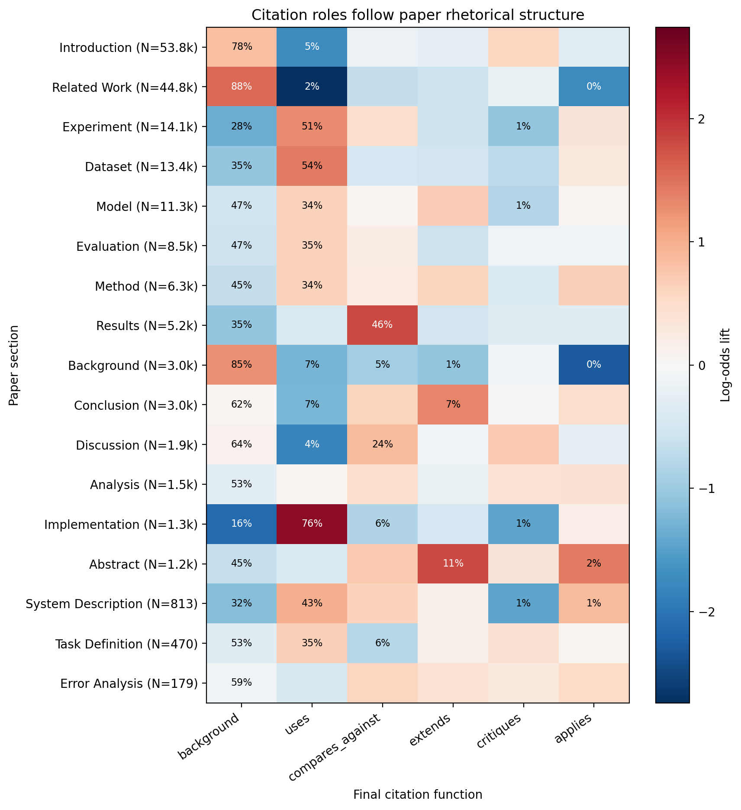
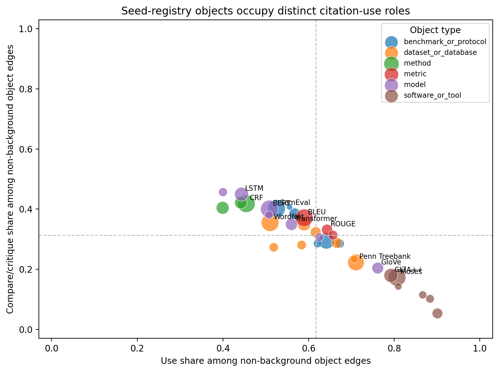
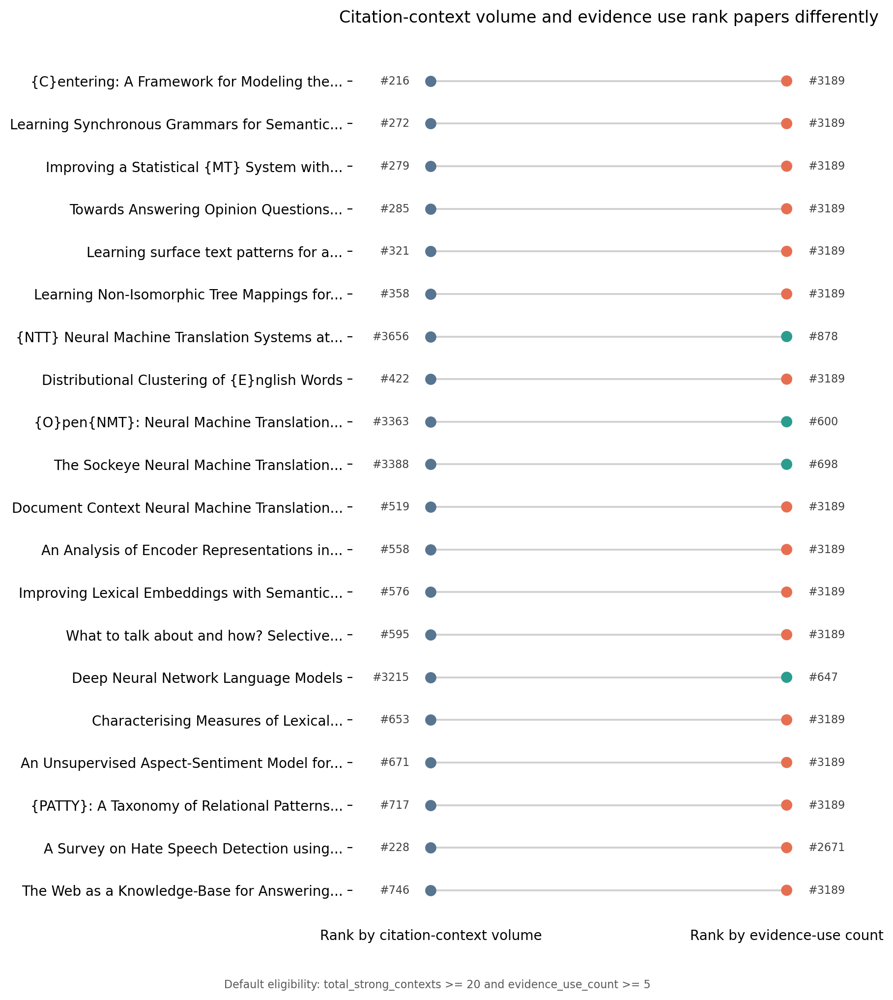
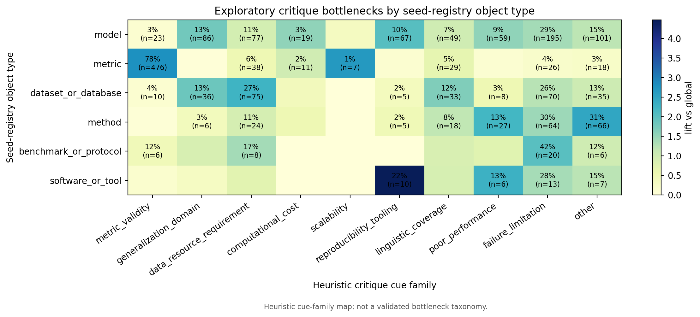

# SciSci-CiteEvidence

- Thesis: citation-context volume, rhetorical section, and object role reveal different kinds of evidence use.
- Course-scale Science-of-Science study over ACL-derived citation contexts for NLP and computational linguistics.
- Output: an evidence-grounded citation-function and seed-registry object-use graph, with explicit QA and limitations.

---

# Motivation: Citation Links Are Not Evidence-Use Links

- A citation edge says that one paper references another; it does not say how the cited work is used.
- Citation contexts expose functions: background framing, operational use, comparison, extension, critique, and application.
- The project asks whether evidence use follows paper structure and whether NLP objects occupy distinct functional roles.
- The central claim is relational: papers, sections, citation functions, and NLP objects carry different signals.

---

# Data Pipeline And Scale

- Extracted 1,990,689 section-aware citation contexts from ACL-OCL-derived full text.
- Resolved 3,152,073 citation-marker components into cited-work candidates.
- Built 1,184,634 analysis-ready strong citation contexts and 322,688 seed-registry object graph candidates.
- Ran Phase-2 only over the full high/medium Phase-1 queue: 306,231 queued rows, yielding 229,751 final analysis-ready labels.
- Constructed 193,287 evidence-backed object-use edges over 33 seed-registry object nodes.

---

# Evidence Policy And QA

- Labels are LLM-assisted, schema-validated, evidence-grounded labels, not human gold annotations.
- Every retained label requires an evidence span grounded in the citation context; final QA reports 229,751 grounded evidence spans.
- The final QA sample contains 500 reviewer-facing rows, including object-risk strata derived from object candidates.
- Evidence cards are compact audit aids for interpretation; they are examples, not adjudicated gold annotations.
- Mean confidence in final analysis-ready labels is 0.892, with confidence summarized by final intent.

---

# Finding 1: Section-Function Grammar

- Citation roles follow paper rhetorical structure rather than appearing uniformly across sections.
- Implementation sections overrepresent `uses`; results sections overrepresent `compares_against`.
- Related-work sections strongly overrepresent `background`, supporting the expected rhetorical role of literature framing.
- Unknown sections are retained explicitly and excluded from the main heatmap panel by default.

---

# Finding 2: Seed-Registry Object Role Signatures

- NLP objects have different citation-use profiles: background canon, operational infrastructure, evaluation anchors, critique targets, and mixed roles.
- BERT and BLEU are high-volume mixed-role objects; LSTM and Transformer skew toward canonical background in this seed registry.
- GloVe, Moses, and ROUGE show operational-infrastructure profiles with high use share among non-background edges.
- These claims are over a curated seed-registry object-use graph, not the full universe of NLP methods.

---

# Finding 3: Citation-Context Volume vs Evidence Use

- Citation-context volume is not the same as evidence use.
- Some cited papers are frequent context anchors but mostly background; others have fewer contexts but stronger direct evidence-use profiles.
- The ranking figure excludes thin-tail artifacts by requiring `total_strong_contexts >= 20` and `evidence_use_count >= 5`.
- `total_strong_contexts` measures citation-context volume, not graph in-degree.

---

# Finding 4: Exploratory Critique Bottlenecks

- Critique contexts reveal recurring limitation cue families: metric validity, generalization, data requirements, cost, scalability, tooling, and coverage.
- Metric objects are especially associated with metric-validity critique cues.
- Software/tool objects show elevated reproducibility-tooling cues in the current matrix.
- This bottleneck taxonomy is heuristic and should be treated as exploratory until QA-backed.

---

# What This Is Not

- Phase-2 covers the full high/medium Phase-1 queue, not all strong contexts.
- The labels are LLM-assisted, schema-validated, evidence-grounded labels, not human gold annotations.
- The object graph is a curated seed-registry object-use graph, not a comprehensive map of every NLP method or resource.
- The current release is not an Intern-Atlas-level method evolution graph; it is an evidence-backed citation-function and object-use layer.
- Critique bottleneck families are heuristic cue groups, not a validated limitation taxonomy.

---

# Toward Intern-Atlas-Like Method/Object Evolution Graphs

- Intern-Atlas motivates the next step: move from document-level references toward typed method/object relationships grounded in source evidence.
- SciSci-CiteEvidence contributes the evidence layer: section-aware contexts, citation-function labels, object mentions, and evidence-backed edges.
- Future work should add expert-curated evolution chains, relation QA, temporal validation, and broader object discovery.
- The goal is not to relabel this release as a method-evolution system, but to make that future system auditable.

---

# Takeaways

- Citation-context volume, paper rhetoric, and evidence-use function are separable Science-of-Science signals.
- Section-function lift replaces raw distribution views with a claim-driven rhetorical-structure test.
- Seed-registry objects show role signatures that distinguish background canon from operational and evaluative infrastructure.
- Ranking reversals show why paper prominence by context frequency can disagree with direct evidence use.
- The release is useful because it is evidence-grounded and caveated, not because it claims exhaustive coverage.

---

# Appendix: Reproducibility And Artifacts

- Final report: `reports/final_scisci_results_report_release.md`.
- Figure source tables: `figures/final_release/source_data/*.csv`.
- Final figures: `figures/final_release/f02_*.png` through `figures/final_release/f05_*.png`.
- Audit aids: `data/processed/final_release_qa_sample.csv` and `data/processed/final_release_evidence_cards.csv`.
- Reproducible runner: `citeevidence analysis final-release`, using existing local derived outputs and no API or Batch jobs.
